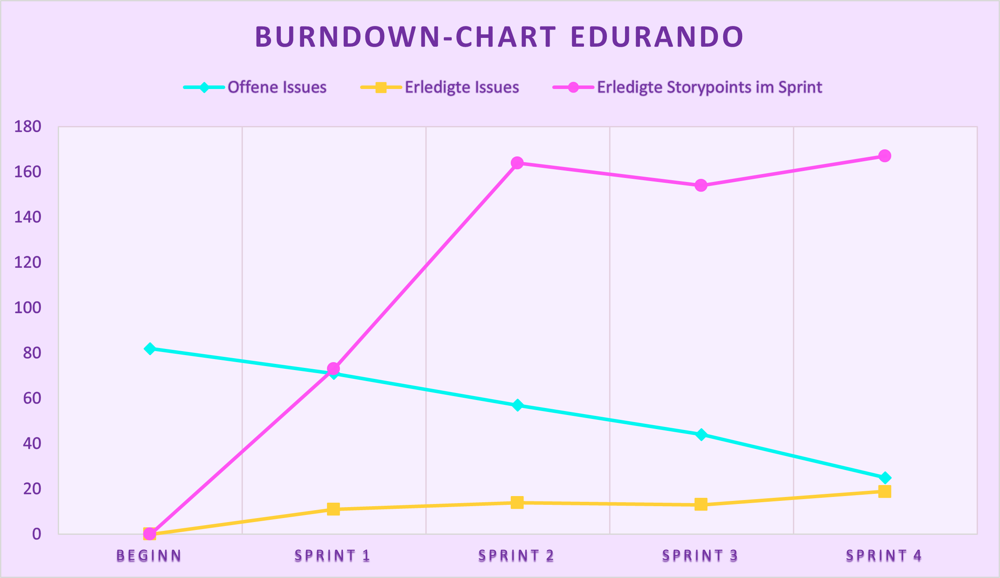

# Dokumentation

## Inhaltsverzeichnis


- [Softwarearchitektur und „schwierige“ Implementierungsprobleme](#softwarearchitektur-und-schwierige-implementierungsprobleme)
  - [Axios](#axios)
  - [Pinia](#pinia)
  - [Authentication (DaoAuthenticationProvider)](#authentication-daoauthenticationprovider) 
- [Testkonzept](#testkonzept)
- [DoD](#dod)
- [Branching Modell](#branching-modell)
- [Test-, Buildautomatisierung, CI](#test-buildautomatisierung-ci)
- [Schätzungen](#schätzungen)
- [Burndown-Chart](#burndown-chart)
- [Velocity des Teams](#velocity-des-teams)
- [Reflektion über Probleme im Sprint](#reflektion-über-probleme-im-sprint)
- [Usability](#usability)
## Softwarearchitektur und „schwierige“ Implementierungsprobleme

Die Softwarearchitektur des Projekts umfasst eine Vielzahl von Komponenten, die gemeinsam arbeiten, um eine robuste und leistungsstarke Anwendung zu ermöglichen. Das Fundament dieser Architektur bildet das Backend-Framework Spring Boot. Mit seiner Unterstützung können Entwickler effizient und schnell das Backend der Anwendung entwickeln. Spring Boot bietet eine Vielzahl von Funktionen und Erweiterungen, die die Entwicklung erleichtern und die Wartbarkeit der Anwendung verbessern.

Um die Daten der Anwendung zu speichern, wird die relationale Datenbank Postgresql verwendet. Diese bewährte Datenbanktechnologie bietet eine solide Grundlage für die Speicherung und Abfrage von Daten. Mit Postgresql können komplexe Datenmodelle effizient modelliert und verwaltet werden, um die Anforderungen der Anwendung zu erfüllen.

Für das Frontend-Design setzt die Architektur auf das CSS-Framework Tailwind. Mit Tailwind können Entwickler schnell und einfach attraktive Benutzeroberflächen gestalten. Das Framework bietet eine umfangreiche Sammlung von vorgefertigten Komponenten und Klassen, die es ermöglichen, das Erscheinungsbild des Frontends flexibel anzupassen.
Die Entwicklung des Frontends erfolgt unter Verwendung des JavaScript-Frameworks Vue.js. Vue.js ist eine leistungsfähige und flexible Plattform für die Entwicklung von interaktiven Benutzeroberflächen. Es ermöglicht die Erstellung von reaktiven Komponenten und erleichtert die Integration mit dem Backend der Anwendung. Vue.js bietet Entwicklern eine intuitive Syntax und umfangreiche Bibliotheken, um komplexe Frontend-Logik zu implementieren und eine nahtlose Benutzererfahrung zu gewährleisten.

### Axios
Für die Verbindung zwischen Frontend und Backend haben wir die JavaScript-Bibliothek "Axios" verwendet.

##### Einführung
Axios ist eine JavaScript-Bibliothek, die für die Verbindung zwischen Frontend und Backend verwendet wird. Mit Axios können HTTP-Anfragen von der Frontend-Anwendung an den Backend-Server gesendet und die entsprechenden Antworten empfangen werden.

##### Installation
Um Axios in Ihr Projekt zu integrieren, führen Sie bitte die folgenden Schritte aus:

1. Öffnen Sie die Kommandozeile und navigieren Sie zum Projektverzeichnis.
2. Führen Sie den Befehl `npm install axios` aus, wenn Sie npm verwenden, oder `yarn add axios`, wenn Sie yarn bevorzugen.

##### Verwendung
###### Importieren
Importieren Sie Axios in Ihrer Vue-Anwendung:
```javascript
import axios from 'axios';
````

###### Senden einer HTTP-Anfrage
Axios stellt die Methode axios.request() zur Verfügung, um HTTP-Anfragen zu senden. Sie akzeptiert ein Konfigurationsobjekt als Parameter, das verschiedene Optionen enthält, wie z.B. die URL der Anfrage, den HTTP-Verb (GET, POST, PUT, DELETE usw.) und optional die zu sendenden Daten.

Hier ist ein Beispiel für das Senden einer GET-Anfrage:

```javascript
onMounted(async () => {
    try {
        const response = await axios.get("http://localhost:9001/api/v1/top-users");
        responseData.value = response.data;
        console.log(responseData.value)
    } catch (error) {
        console.log(error)
    }
});
```
In diesem Beispiel wird eine GET-Anfrage an die URL 'http://localhost:9001/api/v1/top-users' gesendet. Die empfangene Antwort ist im Feld response.data verfügbar. Bei einem Fehler wird dieser im error-Objekt erfasst.

Für andere HTTP-Verben wie POST, PUT oder DELETE können Sie die entsprechenden Methoden axios.post(), axios.put() oder axios.delete() verwenden.

### Pinia
Um den Angemeldeten User zu speichern haben wir die State-Management-Bibliothek von Vue.js verwendet.

##### Einführung
Pinia ist eine Zustandsverwaltungsbibliothek für Vue.js-Anwendungen. Sie bietet eine einfache und effektive Möglichkeit, den Zustand Ihrer Anwendung zu verwalten und die Daten zwischen Komponenten zu teilen. Pinia wurde speziell für Vue entwickelt und integriert sich nahtlos in die Vue-Ökosystem.

##### Installation
Um Pinia in Ihrem Vue-Projekt zu verwenden, müssen Sie es zuerst installieren. Hier sind die Schritte, um Pinia zu installieren:

1. Öffnen Sie die Kommandozeile und navigieren Sie zum Projektverzeichnis.
2. Führen Sie den Befehl `npm install pinia` aus, wenn Sie npm verwenden, oder `yarn add pinia`, wenn Sie yarn bevorzugen.

##### Verwendung
###### Importieren
Importieren Sie Pinia in Ihrer Vue-Anwendung:
```javascript
import { createPinia } from 'pinia';
import { createApp } from 'vue';

const app = createApp();

app.use(createPinia());
````
Dieser Code erstellt eine neue Pinia-Instanz und registriert sie in Ihrer Vue-Anwendung.

###### Beispiel für das erstellen eines Pinia-Moduls
Erstellen Sie ein Pinia-Modul:
```javascript
import { defineStore } from 'pinia';

export const useUserStore = defineStore('user', {
  state: () => ({
    user: null,
  }),
  actions: {
    setUser(user) {
      this.user = user;
    },
  },
});
````
In diesem Beispiel wird ein Pinia-Modul mit dem Namen "user" erstellt. Es enthält einen Zustand "user", der standardmäßig auf null gesetzt ist, und eine Aktion "setUser", um den Benutzer zu aktualisieren.

###### Beispiel für das Speichern eines Users in dem Local Storage
Nach dem Anmelden den User in dem Local Storage speichern:
```javascript
import {reactive} from "vue";
import {useUserStore} from "@/store/store";

const userStore = useUserStore()

const user = reactive({
  email: '',
  password: ''
})

async function saveUserInLocalStorage() {
  try {
    const response = await axios.get(`http://localhost:9001/api/v1/profileByEmail/${user.email}`);

    // User im Localstorage speichern
    await userStore.setUser(response.data);
  } catch (error) {
    console.log(error)
  }
}
````
In diesem Beispiel wird das Pinia-Modul useUserStore in der Komponente verwendet. Durch den Aufruf von useUserStore() wird eine Instanz des Moduls erstellt und der Zustand und die Aktionen können verwendet werden.

Beachten Sie, dass die useUserStore()-Funktion reaktiv ist. Wenn sich der Zustand des Moduls ändert, werden die Komponenten automatisch aktualisiert.

### Authentication (DaoAuthenticationProvider) 
Um die Authentication von Benutzern in Edurando durchzuführen, wird DaoAuthenticationProvider benutzt.Der DaoAuthenticationProvider ist eine Implementierung des AuthenticationProvider-Interfaces und bietet eine einfache Möglichkeit, Benutzeranmeldeinformationen zu überprüfen und die Authentifizierung durchzuführen. Er arbeitet eng mit einem UserDetailsService zusammen, um Benutzerdetails abzurufen und zu überprüfen.

Der DaoAuthenticationProvider verfolgt den Ansatz, Benutzerdetails aus einer Datenbank oder einem anderen Speicherort abzurufen und die eingegebenen Anmeldeinformationen mit den gespeicherten Informationen zu vergleichen. Dazu verwendet er das UserDetailsService-Interface, um die Benutzerdetails abzurufen, und den PasswordEncoder, um die eingegebenen Passwörter zu überprüfen.
Um die Authentication in Edurando umzusetzen, wird der folgende Code verwendet:

```java

@Bean
public DaoAuthenticationProvider daoAuthenticationProvider() {
    DaoAuthenticationProvider provider = new DaoAuthenticationProvider();
    provider.setPasswordEncoder(bCryptPasswordEncoder);
    provider.setUserDetailsService(userProfileService);
    return provider;
}
```

##### Passwortverschlüsselung

Die Sicherheit der Benutzerpasswörter ist entscheidend. Deshalb wird einen Passwortencoder (BCryptPasswordEndocer) verwendet um die Passwörter zu verschlüsseln. Der BCryptPasswordEncoder nutzt die starke und sichere Hash-Funktion BCrypt, um die Passwörter zu verschlüsseln. Durch die Verwendung von Salt-Werten und einer sicheren Hash-Funktion wird die Sicherheit der Passwörter verbessert und der Schutz vor Angriffen wie Brute-Force oder Rainbow-Table-Angriffen gewährleistet.  

##### Benutzerdetails-Service

Der DaoAuthenticationProvider benötigt einen UserDetailsService, um die Benutzerdetails abzurufen.

Durch die Kombination dieser Komponenten in der Softwarearchitektur entsteht eine robuste und skalierbare Anwendung. Die klare Trennung von Backend und Frontend ermöglicht es den Entwicklern, sich auf ihre jeweiligen Aufgaben zu konzentrieren und effizient zusammenzuarbeiten. Die Verwendung bewährter Frameworks wie Spring Boot, Postgresql, Tailwind und Vue.js stellt sicher, dass die Anwendung auf einer soliden Basis aufbaut und den Anforderungen der Benutzer gerecht wird.

## Testkonzept

Das Testkonzept für das Projekt setzt sich aus mehreren wichtigen Punkten zusammen, um eine umfassende Testabdeckung und eine hohe Qualität der Anwendung zu gewährleisten.

Ein entscheidender Aspekt des Testkonzepts ist die Code-Coverage. Ziel ist es, sowohl im Backend als auch im Frontend eine Testabdeckung von mindestens 70% zu erreichen. Dies bedeutet, dass mindestens 70% des Quellcodes durch Tests abgedeckt werden sollen, um potenzielle Fehler und Lücken zu identifizieren und zu beseitigen.

Für das Backend werden zwei Arten von Tests durchgeführt. Zum einen werden Postman-Tests eingesetzt, um die Schnittstellen und Endpunkte der API zu überprüfen und sicherzustellen, dass sie korrekt funktionieren. Diese Tests ermöglichen es, Anfragen an die API zu senden und die erwarteten Antworten zu validieren. Zum anderen werden JUnit-Tests verwendet, um einzelne Komponenten und Funktionen im Backend auf ihre Funktionalität und Zuverlässigkeit zu prüfen. Dies umfasst Tests für spezifische Methoden, Verarbeitungsfunktionen und andere Backend-Logik.

Zusätzlich zu den genannten Tests wird das Projektteam auch manuelle Tests durchführen, um sicherzustellen, dass alle Funktionen aus Benutzersicht korrekt funktionieren und eine nahtlose Benutzererfahrung bieten.

Durch dieses Testkonzept wird das Projekt in der Lage sein, eine robuste, fehlerfreie und zuverlässige Anwendung bereitzustellen, die den Anforderungen und Erwartungen der Benutzer entspricht.

## DoD

Das Projekt hat erfolgreich alle gestellten Anforderungen vollständig implementiert und alle Funktionen der Anwendung funktionieren wie erwartet. Durch die umfassende Entwicklung von Unit Tests wurde sichergestellt, dass der Code zuverlässig und fehlerfrei arbeitet, da alle Tests erfolgreich durchlaufen wurden.

Sowohl die funktionalen als auch die nicht-funktionalen Anforderungen wurden erfüllt, und die Akzeptanzkriterien der User Stories wurden erfolgreich umgesetzt. Dadurch entspricht die Anwendung den Erwartungen und Anforderungen der Nutzer.

Der entwickelte Code wurde ordnungsgemäß im Versionskontrollsystem (Repository) eingecheckt und ist somit dokumentiert und für das gesamte Team verfügbar.

Es wurden keine kritischen Bugs oder offenen Fehler identifiziert, was darauf hinweist, dass das Projekt gründlich getestet wurde und potenzielle Probleme frühzeitig behoben wurden.

Der Code wurde nicht nur von einem, sondern von mehreren Teammitgliedern überprüft und genehmigt, um sicherzustellen, dass er den gemeinsamen Qualitätsstandards und den Best Practices entspricht.

Im Anschluss wurde der Code in einem stabilen Build oder einem entsprechenden Branch erfolgreich integriert, um sicherzustellen, dass alle Änderungen nahtlos zusammenarbeiten und keine Konflikte entstehen.

Schließlich wurde der Code von einem Continuous Integration (CI)-System automatisch gebaut und getestet. Dies ermöglicht eine automatisierte Überprüfung des Codes nach jeder Integration und trägt dazu bei, dass die Anwendung stets auf einem stabilen und funktionierenden Stand bleibt. Dadurch wird auch sichergestellt, dass das Projektteam sofort über potenzielle Probleme oder Fehler informiert wird und diese schnell beheben kann, bevor sie sich auf die Gesamtintegrität der Anwendung auswirken.

Insgesamt hat das Projektteam erfolgreich eine hochwertige, voll funktionsfähige und zuverlässige Anwendung entwickelt, die den hohen Qualitätsstandards des Testkonzepts entspricht.

## Branching Modell

In diesem Projekt haben wir uns für die Verwendung des Gitflow-Branching-Modells entschieden, um eine strukturierte und effiziente Arbeitsweise zu gewährleisten. Das Modell besteht aus mehreren Hauptzweigen, die klare Funktionen und Zwecke haben.

Der Hauptzweig "master" ist der zentrale Branch, der die stabile Produktionsversion unserer Anwendung enthält. Alle Änderungen, die in diesem Branch landen, müssen sorgfältig überprüft und getestet werden, um die Qualität und Stabilität der Anwendung zu gewährleisten. Neue Versionen werden von hier aus veröffentlicht.

Der Branch "develop" dient als Entwicklungsbranch. Von hier aus werden alle neuen Features, Verbesserungen und Änderungen abgezweigt. Der "develop"-Branch repräsentiert den neuesten Stand der Entwicklung und enthält die gesamte Arbeit, die für die nächste geplante Version geplant ist.

Für die Entwicklung neuer Funktionen verwenden wir den Namenskonvention "feature/{name}" für die Feature-Branches. Diese Branches werden von "develop" abgezweigt und enthalten alle notwendigen Änderungen, um die spezifische Funktionalität zu implementieren. Sobald ein Feature vollständig entwickelt, getestet und von anderen Teammitgliedern geprüft wurde, wird es in den "develop"-Branch zurückgeführt.

Im Falle von kritischen Fehlern oder Bugs in der Produktionsversion verwenden wir die Branches mit der Namenskonvention "hotfix/{name}". Diese Hotfix-Branches werden direkt vom "master"-Branch abgezweigt, um die Fehler zu beheben. Sobald der Hotfix entwickelt und getestet wurde, wird er direkt in den "master"- und den "develop"-Branch zurückgeführt, um sicherzustellen, dass die Fehlerbehebung sowohl in der aktuellen Produktionsversion als auch in der nächsten Version enthalten ist.

Durch dieses Gitflow-Branching-Modell gewährleisten wir eine klare Strukturierung und eine geordnete Entwicklung unserer Anwendung. Es hilft uns, neue Funktionen nahtlos in die Entwicklung zu integrieren, kritische Fehler schnell zu beheben und gleichzeitig eine stabile und zuverlässige Produktionsversion aufrechtzuerhalten.

## Test-, Buildautomatisierung, CI

1. Technologie-Stack:
  Junit Tests mit Mock und Postman Tests

2. Verzeichnisstruktur und Organisationsansatz:
  Die Anwendung selbst verwendet die Postgresql Datenbank.
  Für das Testen wurde eine seperate h2 in-momory-dantenbank
  erstellt. Dafür wurde die Datenbank im Ordner src/test
  resources/application.properties konfiguriert. Und im
  Ordner src/test/java wurden die Tests erstellt.

3. Testautomatisierung:
   - Automatisierte Testarten:
   Die Junit Tests werden automatisiert getestet

   - Testframeworks und Ausführung:
     Die automatisierten Tests sind die Junit Tests die wir
     mit der Verwendung von Mock erstellt haben.

4. Build-Automatisierung:
   - Build-Prozess:
   Mit der Ausführung von "gradlew" werden die Quellcodes der
   Anwendung kompiliert. Dabei werden die Java-Klassen aus
   den Quelldateien generiert und in ausführbaren Bytecode
   übersetzt

5. CI-Konfiguration:
   - Stages:
   Es werden drei Stages definiert: "build", "test" und
   "deploy". Stages definieren die Abschnitte des CI
   CD-Pipelines.

   - Before Script:
   Im "before_script"-Abschnitt werden einige Befehle
   ausgeführt, bevor die Jobs in den Stages beginnen.
   In diesem Fall wird der Gradle-Benutzerverzeichnis
   GRADLE_USER_HOME) konfiguriert und das Paket "findutils"
   mit dem Befehl apt-get install findutils installiert.

6. Testsuite-Ausführung:
   - Build-Job:
   Der Build-Job befindet sich in der "build" Stage.
   Der Job wechselt zum Verzeichnis Edurando_App/Edurando
   und führt dann den Build-Prozess aus.
   Der Befehl ./gradlew build kompiliert das Projekt mit
   Gradle.
   Nach erfolgreichem Build wird die Meldung "Compile
   complete" ausgegeben.
   
   - Unit-Test-Job:
   Der Unit-Test-Job befindet sich in der "test" Stage.
   Der Job wechselt zum Verzeichnis Edurando_App/Edurando
   und führt dann die JUnit-Tests aus.
   Der Befehl ./gradlew test führt die JUnit-Tests mit
   Gradle aus.
   Nach Abschluss der Tests wird die Meldung "JUNIT tests
   succeeded with a code coverage of 74%" ausgegeben.

7. Testdatenmanagement:
    - Die Datenbank wird am Anfang der Pipeline erstellt und
  die Daten die im Test hinzugefügt werden hinzugefügt. Am
  Ende der Pipeline werden die Daten von der Datebank
  gelöscht. 


## Schätzungen

| Epen   | Titel                                 | Schätzung am Anfang | Schätzung am Ende |
| ------ | ------------------------------------- | ---- | -------- |
|E1      |Registrieren                           |69    |85        |   
|E2      |Anmelden                               |21    |70        |
|E3      |Profile durchstöbern                   |46    |63        |
|E4      |Nachhilfe bezahlen                     |0     |0         |
|E5      |Profil bearbeiten                      |63    |79        |
|E6      |Startseite durchsuchen                 |52    |52        |
|E7      |Passwort vergessen                     |31    |60        |
|E8      |Chatfenster zwischen Student und Lehrer|55    |55        |
|E9      |Bewerten                               |0     |0         |
|E10     |Konto löschen                          |0     |0         |
|E11     |Abmelden                               |13    |21        |
|E12     |Einstellungen                          |0     |0         |
|Summe   |                                       |350   |485       |


## Burndown-Chart


## Velocity des Teams

Der Velocity-Bericht dokumentiert die Geschwindigkeit unseres Teams basierend auf den erledigten Storypoints in jedem Sprint. Die Velocity ist ein Indikator für die Effizienz und Produktivität des Teams.


| Sprint | Offene Issues | Erledigte Issues | Erledigte Storypoints im Sprint |
| ------ | ------ | ------ | ------ |
|Beginn  |82        |0     |0
|1       |71        |11    |73
|2       |57        |14    |164
|3       |44        |13    |154
|4       |25        |19    |167


Sprint 1:
In Sprint 1 wurden 11 Issues erfolgreich abgeschlossen, was zu einer Velocity von 73 Storypoints führte. Obwohl noch 71 offene Issues vorhanden waren, konnten wir als Team in diesem Sprint eine solide Leistung erzielen.

Sprint 2:
Der Velocity-Wert stieg deutlich auf 164 Storypoints an, da das Team 14 weitere Issues erfolgreich abschließen konnte. Die Anzahl der offenen Issues reduzierte sich auf 57, was darauf hindeutet, dass das Team effektiv an der Bewältigung von Aufgaben arbeitete und die Produktivität steigerte.

Sprint 3:
Auch in diesem Sprint konnten wir als Team eine Leistung mit 154 erledigten Storypoints aufrechterhalten. Obwohl die Anzahl der offenen Issues weiter auf 44 sank, blieb die Velocity stabil. Dies weist darauf him, dass wir komplexere oder umfangreichere Aufgaben bearbeiteten, die mehr Zeit in Anspruch nahmen.

Sprint 4:
Im letzten Sprint wurde ein bemerkenswerter Anstieg der Velocity auf 167 Storypoints verzeichnet. Dieses Mal wurden 19 Issues erfolgreich abgeschlossen, und die Anzahl der offenen Issues sank auf 25. Wir konnten unsere Produktivität steigern und eine höhere Geschwindigkeit bei der Bearbeitung der Aufgaben erreichen.

Der Velocity-Bericht zeigt, dass wir als Team im Verlauf der Sprints eine positive Entwicklung in Bezug auf die Effizienz und Arbeitsgeschwindigkeit gezeigt haben. Obwohl die Anzahl der offenen Issues variieren kann, konnten wir kontinuierlich eine hohe Anzahl an Storypoints abschließen und somit den Projektfortschritt vorantreiben.

## Reflektion über Probleme im Sprint
Das Softwareprojekt Edurando hat uns vor verschiedene Herausforderungen gestellt, insbesondere aufgrund seiner Komplexität und der Größe unseres Entwicklungsteams. Wir haben mit der agilen Methode Scrum gearbeitet, wobei wir in 2-wöchigen Sprints gearbeitet haben. In diesem Prozess traten jedoch einige Probleme auf, die wir reflektieren und daraus lernen können.

Effizientes Arbeiten und Aufgabenverteilung: Da es unser erstes größeres Softwareprojekt in einer Gruppe war, mussten wir uns anfangs an das effiziente Arbeiten in einem Team gewöhnen. Die Aufgabenverteilung war manchmal eine Herausforderung, da es wichtig war, dass alle Teammitglieder produktiv und effektiv arbeiten konnten. Hier hätten wir von Anfang an die Aufgaben etwas  ausgewogener und klarer verteilen sollen. 

Vollständiger Abschluss der Sprints: Eine der größten Herausforderungen bestand darin, die geplanten Aufgaben innerhalb der festgelegten Sprints abzuschließen. Oft mussten wir feststellen, dass wir am Tag des Sprint-Reviews nicht alle geplanten Aufgaben abgeschlossen hatten. Dies führte teilweise zu Aufgabenstau und beeinträchtigte den Fortschritt des Projekts. Es war wichtig, dass wir unsere Aufgaben realistisch einschätzten und uns auf die wichtigsten Funktionen konzentrierten, um sicherzustellen, dass wir sie innerhalb der Sprints erfolgreich abschließen konnten. Da wir uns in dem Scrum-Prozess erstmal zurechtfinden mussten, hat sich im Verlauf des Projekts das realistische Einschätzen der Aufgaben, die wir innerhalb eines Sprints bewältigen konnten, deutlich gebessert, was sich positiv auf unsere Velocity auswirkte. 

Zeitmanagement: Das effektive Zeitmanagement war eine weitere Herausforderung. Manchmal haben wir uns in Details verloren und uns nicht rechtzeitig auf die Hauptfunktionen von Edurando konzentriert, wie beispielsweise das Durchsuchen und Anzeigen der Startseite, die Chatfunktion und die Möglichkeit das eigene Profil zu bearbeiten. Dies führte manchmal zu kleinen Verzögerungen und einem erhöhten Druck am Ende der Sprints. Das Zeitmanagement-Problem wird auch damit zusammenhängen, dass Edurando unser erstes richtiges Software-Projekt ist, und wir den Großteil der Technologien (Vue-Js, Axios, Pinia, Spring Security, Mock-Testing, …) und Funktionalitäten, welche die Software benötigt (Registrieren, Chatten, Profil bearbeiten, …), von Grund auf gelernt haben, was am Anfang viel Zeit in Anspruch genommen hat. Trotz dessen haben wir diese erworbenen Kenntnisse auch noch innerhalb der Projektentwicklung nutzen können, um unsere Entwicklungsgeschwindigkeit hochzuhalten. 

Insgesamt war das Softwareprojekt Edurando eine wertvolle Lernerfahrung für uns als Team. Wir haben erkannt, dass effizientes Arbeiten, klare Kommunikation, gute Aufgabenverteilung und realistisches Zeitmanagement entscheidend für das Entwickeln eines anständigen Softwareprojekts und die damit zusammenhängenden Herausforderungen (ein gutes Arbeitsklima, Teamdynamik, Motivation, …)  sind. Durch die Reflektion über die aufgetretenen Probleme können wir diese als Lehren für zukünftige Projekte nutzen und unsere Arbeitsweise weiter optimieren.

## Usability

Usability-Tests wurden durchgeführt, um die Benutzerfreundlichkeit unserer Anwendung zu bewerten und mögliche Probleme in der Benutzererfahrung zu identifizieren. Dazu wurde ein Aufgabenblatt erstellt (in unserem Repository zu finden als *Usability_Test_Aufgaben.md*), das die Anwendungstester durchgearbeitet haben. Währenddessen wurden Auffälligkeiten und Probleme von uns protokolliert. Dabei sind wir zu folgenden Ergebnissen gekommen:

Die Nutzer fanden sich insgesamt gut auf der Website zurecht. Funktionen waren über Icons, Titel und deren durchdachten Anordnungen leicht zu finden. Probleme in unserer Software ergaben sich jedoch vor allem in Fehlermeldungen. Bei der Registrierung eines neuen Nutzers enstanden Unklarheiten zu den Fehlermeldungen zu Passwortanforderungen. Diese haben den Testenden nicht klar genug aufgezeigt, welche Probleme in ihrem gewählten Passwort vorlagen. Auch gab es keinerlei Hinweise darauf, dass bei der Registrierung eine Studenten-E-Mail-Adresse statt einer *gewöhnlichen* verwendet werden muss.

Auch Fehlermeldungen zur Adresse waren uneindeutig und haben für viel Verwirrung gesorgt. Teilweise wurden auch Fehlermeldungen in der Profilpersonalisierung so kurz angezeigt, dass die Nutzer auf diese nicht rechtzeitig reagieren konnten. Außerdem fehlten auch Bestätigungsmeldungen, z. B. wenn man seine Rolle erfolgreich gewechselt hat (Student -> Teacher).

Auf der Startseite findet man Kärtchen zu den Lehrerprofilen. Hier war das Problem, dass das *X* zum Schließen einer solchen Karte zu klein war und Testende dabei teilweise mehere Versuche gebraucht haben.

Die Navigation bzw. die Suche nach der Funktion zum Hinzufügen von Fächern und Themen stellte sich als sehr versteckt heraus. Außerdem ist hierbei aufgefallen, dass eine zuvor schon heruntergecrollte Seiet dazu führt, dass man die Textfelder von Fächern und Themen nicht gesehen hat und dadurch die Navigation erschwert wurde.

Auch beim Ändern des Passworts fehlten klare Fehlermeldungen im Frontend - diese wurden lediglich vergessen vom Backend in den Frontend zu übertragen. Dieses Problem trat bei der Passowrt-Vergessen-Funktion erneut auf. Abschließend fiel auf, dass es für Nutzer keine Funktion gibt, um Bugs zu melden. Auch diese ist für gute Usability erforderlich.
